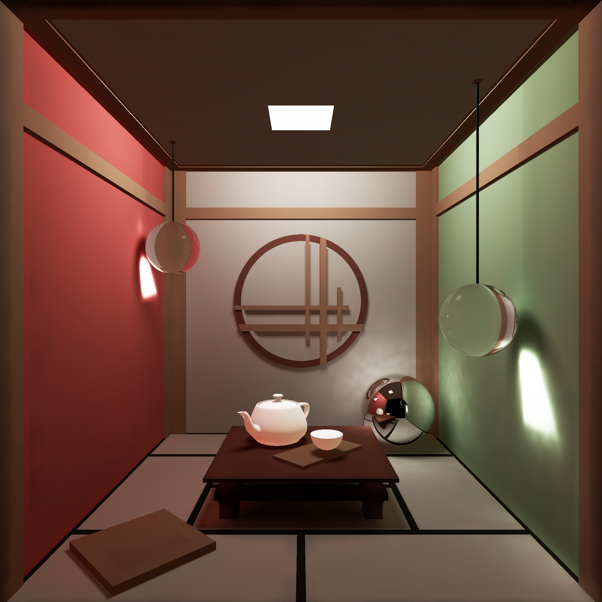

<p align="center"></p>

---
## Rendering Steps
- Direct Illumination and Specular via (Distributed) whitted-style raytracing.
- Indirect Illumination and Caustics via photon map.

---
## More Info
Please refer to [this blog post](https://skittss.github.io/PortfolioWebsite/#/projects/RayTracer) where I describe the features of this raytracer in more detail, and outline how each one was achieved.

---
## Compiling and Running

The source can be compiled using the provided vscode batch properties under `/.vscode`.
\
\
Alternatively, via `g++` with the following command run in working directory `./src/`:
```sh
g++ -I..\lib\include -g main.cpp ..\lib\src\data\*.cpp ..\lib\src\geometry\*.cpp ..\lib\src\materials\*.cpp ..\lib\src\rendering\*.cpp ..\lib\src\util\*.cpp ..\src\scenes\*.cpp -o ..\bin\main.exe
```

---
## Project Structure


|Name|Description|
|:--|:--|
|`./src`|Program entry point and Scene Compositing|
|`./lib`|Core Raytracer functionality|
|`./bin`|Default build directory
|`./exports`|Default render directory

|SubDir|Description
|:--|:--|
|`lib/.../config`|Raytracer config and general parameters (e.g. render output path).|
|`lib/.../data`|Data types including kd-tree and matrices.|
|`lib/.../geometry`|3D Objects|
|`lib/.../lights`|Point and area lights|
|`lib/.../materials`|3D Object Materials (Implementation of BDRFs)|
|`lib/.../rendering`|Core rending code - camera, ray casting and photon mapping|
|`lib/.../textures`|UV-mapped and procedural textures for materials.|
|`lib/.../util`|Various helper functions|
|`lib/include/engine.h`|Lib include manifest (must be edited if new files added)|

<details>
<summary>Full tree view of ./lib</summary>

```
📂lib
 ┣ 📂include
 ┃ ┣ 📂config
 ┃ ┃ ┗ 📜config.h
 ┃ ┣ 📂data
 ┃ ┃ ┣ 📜bounding_box.h
 ┃ ┃ ┣ 📜bounding_volume.h
 ┃ ┃ ┣ 📜colour.h
 ┃ ┃ ┣ 📜framebuffer.h
 ┃ ┃ ┣ 📜hit.h
 ┃ ┃ ┣ 📜kd_tree.h
 ┃ ┃ ┣ 📜object.h
 ┃ ┃ ┣ 📜photon.h
 ┃ ┃ ┣ 📜ray.h
 ┃ ┃ ┣ 📜transform.h
 ┃ ┃ ┗ 📜vector.h
 ┃ ┣ 📂geometry
 ┃ ┃ ┣ 📜csg.h
 ┃ ┃ ┣ 📜cube.h
 ┃ ┃ ┣ 📜object3D.h
 ┃ ┃ ┣ 📜plane.h
 ┃ ┃ ┣ 📜polymesh.h
 ┃ ┃ ┣ 📜quadric.h
 ┃ ┃ ┗ 📜sphere.h
 ┃ ┣ 📂lights
 ┃ ┃ ┣ 📜directional_light.h
 ┃ ┃ ┣ 📜light.h
 ┃ ┃ ┣ 📜point_light.h
 ┃ ┃ ┗ 📜square_light.h
 ┃ ┣ 📂materials
 ┃ ┃ ┣ 📜dielectric.h
 ┃ ┃ ┣ 📜emissive.h
 ┃ ┃ ┣ 📜global_material.h
 ┃ ┃ ┣ 📜lambertian.h
 ┃ ┃ ┣ 📜material.h
 ┃ ┃ ┣ 📜mirror.h
 ┃ ┃ ┣ 📜normat.h
 ┃ ┃ ┗ 📜phong.h
 ┃ ┣ 📂rendering
 ┃ ┃ ┣ 📜camera.h
 ┃ ┃ ┗ 📜scene.h
 ┃ ┣ 📂textures
 ┃ ┃ ┣ 📜block_texture.h
 ┃ ┃ ┣ 📜checker_texture.h
 ┃ ┃ ┣ 📜image_texture.h
 ┃ ┃ ┗ 📜texture.h
 ┃ ┣ 📂util
 ┃ ┃ ┗ 📜util.h
 ┃ ┗ 📜engine.h
 ┗ 📂src
 ┃ ┣ 📂data
 ┃ ┃ ┣ 📜bounding_volume.cpp
 ┃ ┃ ┗ 📜framebuffer.cpp
 ┃ ┣ 📂geometry
 ┃ ┃ ┣ 📜cube.cpp
 ┃ ┃ ┣ 📜plane.cpp
 ┃ ┃ ┣ 📜polymesh.cpp
 ┃ ┃ ┗ 📜sphere.cpp
 ┃ ┣ 📂materials
 ┃ ┃ ┣ 📜lambertian.cpp
 ┃ ┃ ┗ 📜phong.cpp
 ┃ ┣ 📂rendering
 ┃ ┃ ┣ 📜camera.cpp
 ┃ ┃ ┗ 📜scene.cpp
 ┃ ┗ 📂util
 ┃ ┃ ┗ 📜util.cpp
```
</details>

---
## Improvements

- [ ] CMake build file.
- [ ] Multithreading for rendering and and photon tracing.
- [ ] Periodic autosave for large renders.
